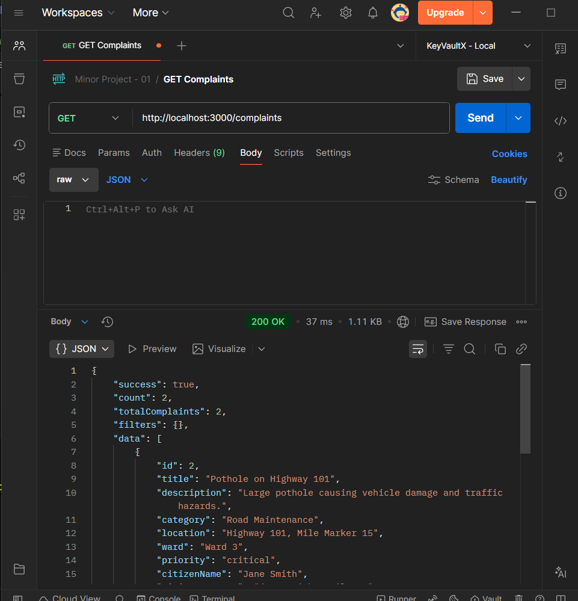
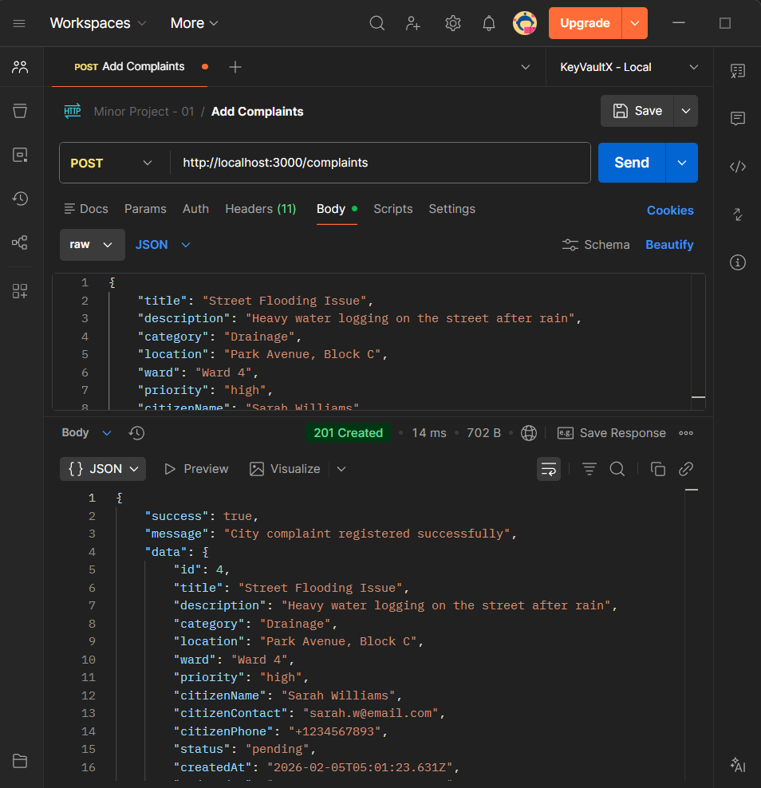
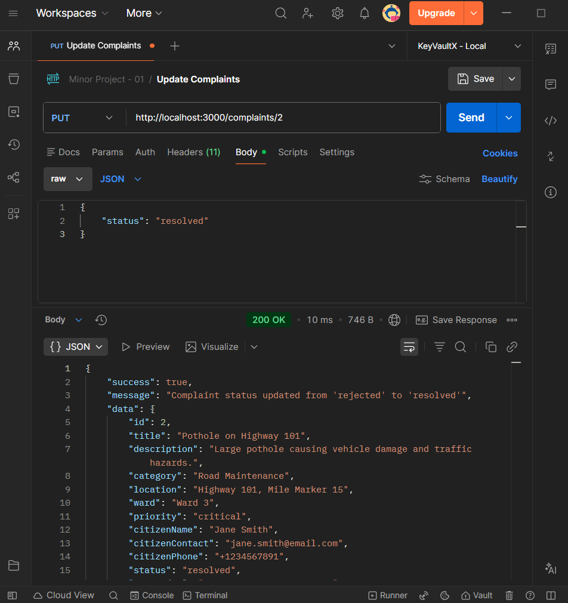
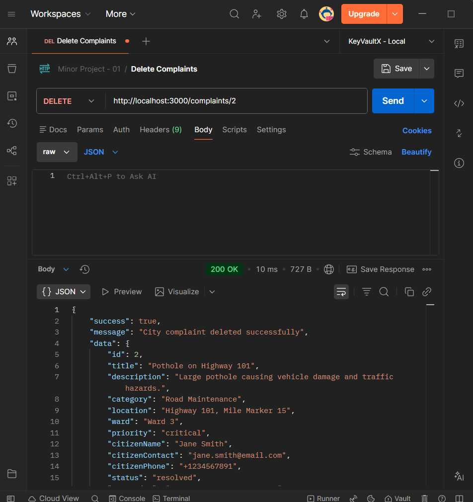

# City Complaint Register API

A backend REST API for managing city complaints and municipal issues. This system allows citizens to register complaints about various city services and enables city officials to track and manage these complaints efficiently

## Functional Requirements

### User Module
- **Submit complaint** - Citizens can register new complaints
- **Auto-generated complaint ID** - System automatically assigns unique IDs
- **Status set to pending** - New complaints default to "pending" status

### Admin Module
- **View all complaints** - Admins can view all registered complaints
- **Update status** - Change complaint status (pending / resolved / rejected)
- **Delete complaint** - Remove complaints from the system

## Features

- Register new city complaints with detailed information
- View all complaints with filtering options (status, category, ward, priority)
- Get complaint statistics by status, category, priority, and ward
- Update complaint status (pending, resolved, rejected)
- Delete complaints (admin only)
- Authentication middleware for protected routes
- Request logging middleware
- In-memory data storage

## Installation

1. Clone the repository
2. Install dependencies:
```bash
npm install
```

3. Start the server:
```bash
npm start
```

The server will run on `http://localhost:3000`

## Quick Start

### 1. Get All Complaints


### 2. Get All Complaints by ID


### 3. Create a New Complaint (User Module)


### 4. Update Complaint Status (Admin Module)


### 5. Delete Complaint (Admin Module)


## Data Model

### Complaint Object
```javascript
{
  id: Number,              // Auto-generated
  title: String,           // Required
  description: String,     // Required
  category: String,        // Required
  location: String,        // Required
  ward: String,            // Optional
  priority: String,        // Optional
  citizenName: String,     // Required
  citizenContact: String,  // Required
  citizenPhone: String,    // Optional
  status: String,          // default "pending"
  createdAt: Date,         // Auto-generated
  updatedAt: Date          // Auto-updated
}
```

### Valid Values

**Categories:**
- Road Maintenance
- Street Lighting
- Waste Management
- Water Supply
- Drainage
- Public Safety
- Parks & Recreation
- Noise Pollution
- Illegal Construction
- Other

**Priorities:**
- low
- medium (default)
- high
- critical

**Status Values:**
- pending (default for new complaints)
- resolved
- rejected

## Middleware

### Logger Middleware
Logs all incoming requests:

### Auth Middleware
Validates authorization header for protected routes (PUT, DELETE operations)


**HTTP Status Codes:**
- `200` - Success
- `201` - Created
- `400` - Bad Request (validation error)
- `401` - Unauthorized
- `404` - Not Found
- `500` - Internal Server Error
