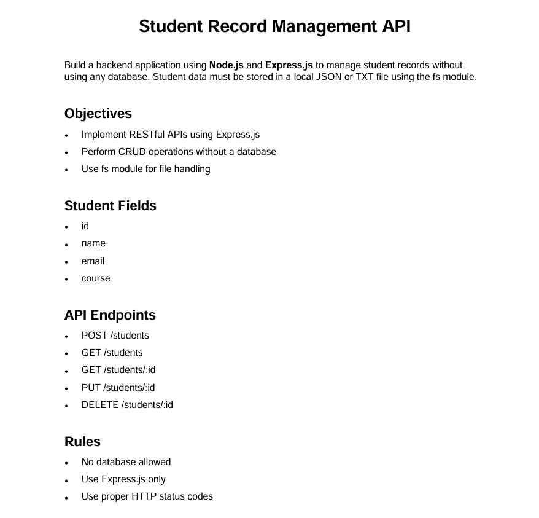

# Student Record Management API

Build a backend application using Node.js and Express.js to manage student records without using any database. Student data must be stored in a local JSON or TXT file using the fs module.

## Objectives

- Implement RESTful APIs using Express.js
- Perform CRUD operations without a database
- Use fs module for file handling

## Student Fields

- id
- name
- email
- course

## API Endpoints

- POST /students
- GET /students
- GET /students/:id
- PUT /students/:id
- DELETE /students/:id

## Rules

- No database allowed
- Use Express.js only
- Use proper HTTP status codes

## Postman Testing

### POST /students

### GET /students

### GET /students/:id

### PUT /students/:id

### DELETE /students/:id

